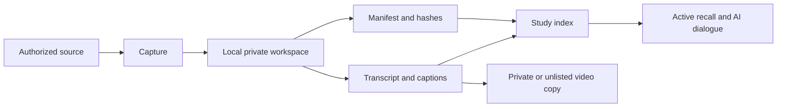

# Course Capture

Turn an authorized course export into a private, searchable, captioned study system.

The system keeps the source material local. It creates a manifest, transcripts, captions, and a compact study index. You can upload your own lecture copy to a private or unlisted video account when your institution permits it.

## Start In 10 Minutes

```bash
git clone https://github.com/shivraj-S-bhatti/course-capture.git
cd course-capture
python3 -m venv .venv
source .venv/bin/activate
python -m pip install -e .
course-capture doctor
```

Create a private workspace outside this repository:

```bash
course-capture init ~/Courses/my-course
course-capture inventory ~/Courses/my-course
course-capture index ~/Courses/my-course/.course-capture/manifest.json
```

Put authorized files in `incoming/`. Put lecture videos in `incoming/videos/`. Real course data is ignored by this repository.

## The Pipeline



1. **Capture:** Use an official export or an authorized API. Use browser automation only for content your account can already access.
2. **Normalize:** Give every file a stable name. Record its hash and type in one manifest.
3. **Process:** Transcribe video locally. Keep the original video, plain text, SRT captions, and timestamped JSON.
4. **Index:** Generate one Markdown map of the course. Add semantic chapters and your own notes.
5. **Study:** Prime before a lecture, annotate during it, then use retrieval practice after it.

## Commands

| Command | Result |
| --- | --- |
| `course-capture init DIR` | Creates a private course workspace. |
| `course-capture canvas ...` | Downloads files, pages, and module metadata through the Canvas API. |
| `course-capture inventory DIR` | Writes a deterministic file manifest with SHA-256 hashes. |
| `course-capture transcribe VIDEO` | Writes `.txt`, `.srt`, and timestamped `.json` files with MLX Whisper. |
| `course-capture caption VIDEO SRT` | Adds a toggleable subtitle track without re-encoding video or audio. |
| `course-capture index MANIFEST` | Writes a compact Markdown study index. |
| `course-capture description SPEC` | Builds a YouTube-ready description from reviewed chapter timestamps. |
| `course-capture doctor` | Checks Python, FFmpeg, FFprobe, and optional MLX Whisper support. |

## Read Next

- [Capture course content](docs/01_CAPTURE.md)
- [Process video and transcripts](docs/02_PROCESS.md)
- [Run the study loop](docs/03_STUDY.md)
- [Understand the engineering skills](docs/04_ARCHITECTURE_AND_SKILLS.md)
- [Protect credentials and course data](SECURITY.md)

## Public Boundary

This repository contains tools, documentation, and synthetic examples. It does not contain lecture recordings, slides, quizzes, answer keys, student data, cookies, tokens, or signed media URLs.

Use the workflow only when the instructor, institution, license, and platform terms permit capture and personal storage. The tools do not bypass access controls. They do not retrieve unreleased assessments.
